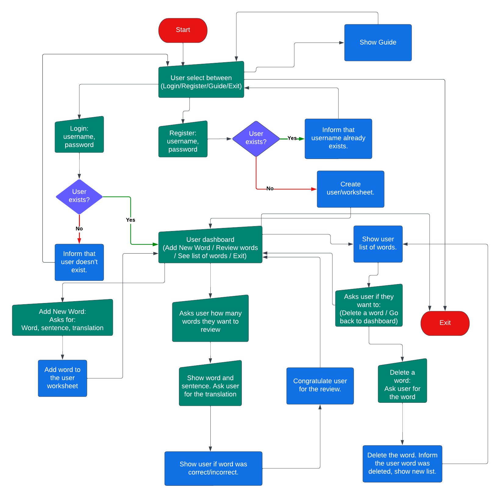
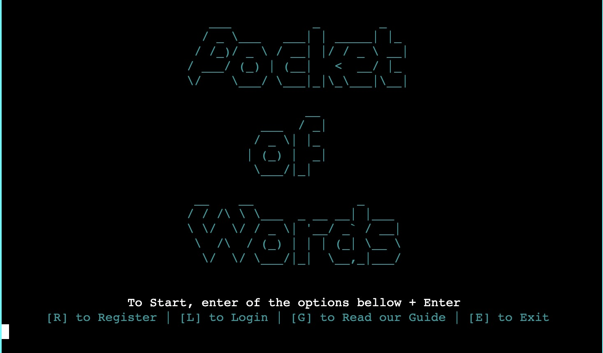
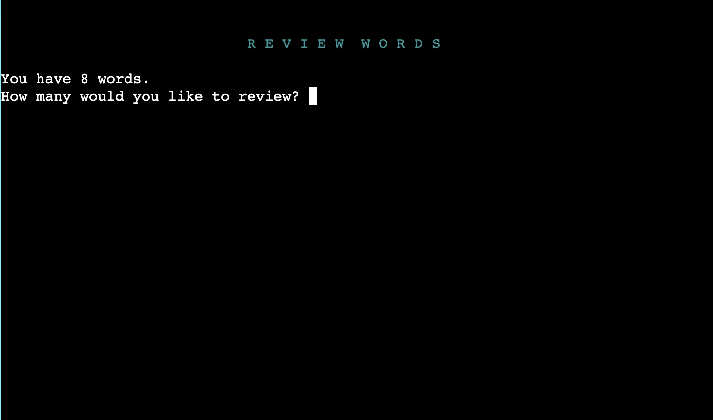

# Pocket of Words

### Deployed Site: [Pocket of Words](https://pocket-of-words.herokuapp.com/)

Pocket of Words is a tool for those learning a new language.

With Pocket of Words the user will be able to create an account, add words and their translation and a sentence to help they remember it.

After that the user can see a list of all their words, delete them and review them.

---

## CONTENTS

* [User Experience](#user-experience-ux)
  * [User Stories](#user-stories)

* [Design](#design)
  * [Colour Scheme](#colour-scheme)
  * [Flow Chart](#flow-chart)
  * [Wireframes](#wireframes)

* [Features](#features)

* [Technologies Used](#technologies-used)
  * [Languages Used](#languages-used)
  * [Python Modules](#python-modules)
  * [Frameworks, Libraries & Programs Used](#frameworks-libraries--programs-used)

* [Testing](#testing)

* [Deployment & Local Development](#deployment--local-development)
  * [Remote Deployment](#remote-deployment)
  * [Local Development](#local-deployment)
    * [How to Fork](#how-to-fork)
    * [How to Clone](#how-to-clone)
    * [Using Gitpod](#using-gitpod)

* [Credits](#credits)
  * [Code Used](#code-used)
  * [Acknowledgments](#acknowledgments)

---

## User Experience (UX)

### User Stories

* I want to create an account.

* I want to see a guide on how to use the program.

* I want to log in on my account.

* I want to exit the program.

* I want to add a new word.

* I want to see a list of my words.

* I want to delete a word.

* I want to review my words.

* I want to quit before review all the words.

* I want to choose how many words to review.

* I want to know if my word is correct/incorrect.

___

## Design

### Colour Scheme

The colour scheme was defined using the colours on the [colorama](https://pypi.org/project/colorama/) Python module.

* `#00FFFF` was used for background, headers, logo, messages.

* `#FF0000` was used for error messages.

* `#00FF00` was used for success messages.

* `#FFFFFF` was used for text.

* `#000000` was used background, button.

### Flow Chart

The flow chart was created using [Lucid](https://lucid.co/).

  
Flow Chart

   

  

### Wireframes

The wireframe was created using [Balsamiq](https://balsamiq.com/).

  
Wireframe

   

  

---

## Features

The project has only one page where the terminal loads the program.

* Main Menu: Here the user has 4 options (Register, Login, See the Guide, Exit)

  * Register: The user can register a new user entering username and password.
    * Username: Needs to have between 4-10 characters. And not be already in use.
    * Password: Needs to have at least 8 characteres.
  

  * Login: The user can enter the username and password previously registered.
  

  * Guide: The user can see the guide on how to use the program.
  

  * Exit: The user exits the program and see a goodbye message.
  

* Logged Menu: Here the user has 4 options (Add a Word, Review Words, See List, Exit)
  

  * Add a Word: The user enters: word, sentence and translation.
  

  * Review Words: The user is informed on how many words they have and asked how many they would like to review. After entering the number the user will see the cards with the words. They can: answers, ask for a hint, and quit.
  

    * Card first presented:
    

    * Card with Hint:
    

    * Card Correct:
    

    * Card Incorrect:
    

    * End of Review:
    

  * See your List: The user sees a list of all the words they have added. They can delete a word.
    

    * Deleting a word:
    

    * Word deleted:
    

---

## Technologies Used

### Languages Used

* Python: to develop the program.

* CSS: to edit the layout on the layout.html page.

### Python Modules

* [datetime](https://docs.python.org/3/library/datetime.html?highlight=datetime#module-datetime) - to get the full date.

* [getpass](https://docs.python.org/3/library/getpass.html?highlight=getpass#module-getpass) - for typing password without displaying it on terminal.

* [os](https://docs.python.org/3/library/os.html?highlight=os#module-os) - to clear the screen.

* [sys](https://docs.python.org/3/library/sys.html?highlight=sys#module-sys) - to exit the system.

* [time](https://docs.python.org/3/library/time.html?highlight=time#module-time) - to add a sleep function between displaying a message and clearing terminal.

* [random](https://docs.python.org/3/library/random.html?highlight=random#module-random) - to select random words from the list when reviewing.

* [re](https://docs.python.org/3/library/re.html?highlight=re#module-re) - to create a regex pattern for username.

* [gspread](https://docs.gspread.org/en/latest/index.html) - to edit worksheets on Google Sheets.

* [google.oauth2.service_account](https://google-auth.readthedocs.io/en/stable/index.html) - to connect with Google account and have access to Google Drive.

* [prettytable](https://pypi.org/project/prettytable/) - to create a table to display the list of words.

* [colorama](https://pypi.org/project/colorama/) - to add colour to the messages and logo.

* [bcrypt](https://pypi.org/project/bcrypt/) - to encrypt password.

### Frameworks, Libraries & Programs Used

This project used:

* [Balsamiq](https://balsamiq.com/) to create the wireframes.

* [Git](https://git-scm.com/) for version control.

* [GitHub](https://github.com/) to store the project files.

* [VS Code](https://code.visualstudio.com/) as the IDE for development.

* [Heroku](https://www.heroku.com/home/) to deploy the website.

* [Lucidchart](https://www.lucidchart.com/) to create the flow chart.

* [Coolors](https://coolors.co/) to create the colour scheme based on the colorama module.

* [patorjk - Text to ASCII Art Generator (TAAG)](https://patorjk.com/software/taag/#p=display&f=Ogre&t=Pocket%20%0A%20%20%20%20%20%20%20%20of%20%0AWords) to convert text to ASCII and create the logo.

---

## Testing

Please check the [TESTING.md](TESTING.md) file for all the tests.

---

## Deployment & Local Development

### Remote Deployment

Before deploying, run 'pip3 freeze > requirements.txt' on the terminal of your IDE of choice.

The site was deployed to Heroku. The steps to deploy are as follows: 
  1. Create an account and log in your [Heroku](https://id.heroku.com/login) account. 
  2. On the dashboard, click on the button New -> Create new app on the right side of the page.
  3. Choose a name and select your region. Click on Create app.
  4. Go to the Settings tab. Scroll down to Config Vars. Add key CREDS and for the value the contents of your creds.json file. Add key PORT and value 8000.
  5. Scroll down to Buildpacks. Add buildpack python. Add buildpack nodejs. In this order.
  6. Go to the Deploy tab. Select GitHub as Deployment Method. Connect your account.
  7. Enter the name of the repository that you forked, search and connect.
  8. Select the branch and click Deploy Branch.

The live link can be found here - [Pocket of Words](https://pocket-of-words.herokuapp.com/)

### Local Development

#### How to Fork

  1. Log In or Sign Up to GitHub.
  2. Go to this project repository [https://github.com/tanisecarvalho/pocket-of-words](https://github.com/tanisecarvalho/pocket-of-words)
  2. On the top right of the page, there's a button with the option Fork. Click on it.
  3. A new page, "Create a new fork", will open. If you wish, you can edit the name.
  4. At the end of the page, click on "Create fork".
  5. Now, you have a copy of the project in your repositories.

#### How to Clone

  1. Log In or Sign Up to GitHub.
  2. Go to this project repository [https://github.com/tanisecarvalho/pocket-of-words](https://github.com/tanisecarvalho/pocket-of-words)
  3. Click on the Code button and select if you would like to clone with HTTPS, SSH or GitHub CLI and copy the link.
  4. Open the terminal in the code editor of your choice and change the current working directory to the one you will use for to clone the repository.
  5. Type 'git clone' into the terminal and then paste the link you copied before and press Enter.

#### Using Gitpod
If you would like to edit your copy of this repository on Gitpod, you will need to: 
  1. On your browser of choice, install the Gitpod extension/add-on.
  2. On GitHub, open the project repository you forked before.
  3. On the top of the page, over the files, there is a green button on the right side of the page saying "Gitpod". Click it.
  4. It will open the Gitpod website. On the first time, you will select to connect with your GitHub account and Authorize gitpod-io. After that, you'll create an account.
  5. It might take a while after that because Gitpod will create your workspace.
  After the workspace is loaded, you can edit it on Gitpod.

---

## Credits

### Code Used

* [This code](https://stackoverflow.com/questions/9202224/getting-a-hidden-password-input) to learn how to get a hidden input for password.

* [This code](https://stackoverflow.com/questions/49745662/centering-ascii-graphics-python) to learn how to center a ASCII logo on the terminal

* [This article](https://www.geeksforgeeks.org/clear-screen-python/) to learn how to clear the terminal.

* [This article](https://www.geeksforgeeks.org/how-to-hash-passwords-in-python/) to see options on how to encrypt passwords.

* Code Institute content on the Love Sandwiches project showing how to connect and use Gspread and deploy the project to Heroku.
 
### Acknowledgments

I would like to thank my Code Institute mentor, Chris Quinn for his support and insightful feedbacks. Plus, to my friends and family for being the first users and hearing me talking about this project since day 1.