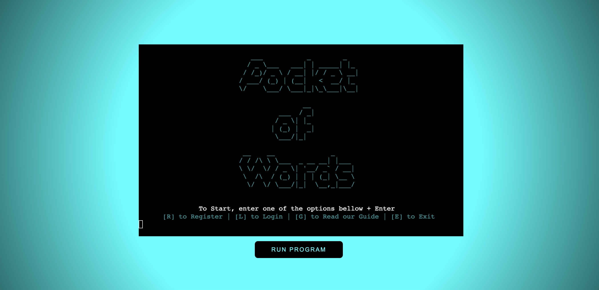
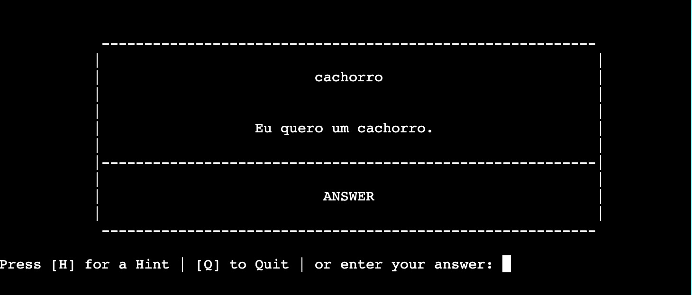
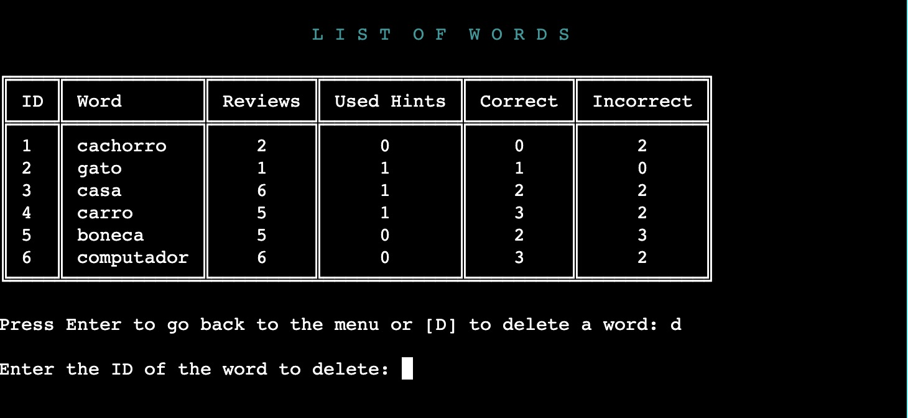

# Pocket of Words - TESTING

### Deployed Site: [Pocket of Words](https://pocket-of-words.herokuapp.com/)

---

## CONTENTS

* [AUTOMATED TESTING](#automated-testing)
  * [Jigsaw Validator](#jigsaw-validator)
  * [CI Python Linter](#ci-python-linter)
  * [Lighthouse](#lighthouse)

* [MANUAL TESTING](#manual-testing)
  * [Testing User Stories](#testing-user-stories)
  * [Full Testing](#full-testing)

* [BUGS](#bugs)
  * [Known Bugs](#known-bugs)

Testing was realised during the whole development of this project. Chrome Devtools was the primary tool utilised in this process. 

Additionally, since the quiz became functional, the site was deployed. The link was shared with friends and family to get their constant feedback towards the functionalities, design and accessibility.

---

## AUTOMATED TESTING

### Jigsaw Validator

As I added some CSS to style the layout.html page, I ran the [Jigsaw Validator](https://jigsaw.w3.org/css-validator/validator?uri=https%3A%2F%2Fpocket-of-words.herokuapp.com%2F&profile=css3svg&usermedium=all&warning=1&vextwarning=&lang=en) on the project.

### CI Python Linter

No errors were found when passing through [CI Python Linter](https://pep8ci.herokuapp.com/). However, some warnings regarding whitespace and invalid escape have shown on the result between lines 53-70. They don't affect the functionality of this program, they are actually necessary to make the logo display correctly.

### Lighthouse

I used Chrome Developer Tools' Lighthouse to test the Performance, Accessibility, Best practices and SEO of the project. The low score on SEO is regarding the lack of the meta tag description.

---

## MANUAL TESTING

### Testing User Stories

| Goals | How are they achieved? |
| :--- | :--- | 
| I want to create an account. | The program gives the user the option to create an account. | 
| I want to see a guide on how to use the program. | The program gives the user the option to see the guide. | 
| I want to log in on my account. | The program gives the user the option to log in on their account. | 
| I want to exit the program. | The program gives the user the option to exit the program. | 
| I want to add a new word. | After the login the user can add words to their 'pocket'. | 
| I want to see a list of my words. | After the login the user has the option to see the list with all their words. | 
| I want to delete a word. | When seeing the list of words the user has the option to delete a word. | 
| I want to review my words. | After the login the user has the option to review their words. | 
| I want to quit before review all the words. | While reviewing the words, the user has the option to quit the review before finish. | 
| I want to choose how many words to review. | When the user select the option to review the words, the program will display how many words they have added and give the user the option to choose how many words to review. |
| I want to know if my word is correct/incorrect. | When reviewing the words the system will display if the user guessed the word correct or not. |

### Full Testing

`Main Menu`

| Feature | Expected Outcome | Testing Performed | Result | Pass/Fail |
| --- | --- | --- | --- | --- |
| Register | Open the Register Section | Press R + Enter | Opens the Register Section | Pass |
| Login | Open the Login Section | Press L + Enter | Opens the Login Section | Pass |
| Guide | Open the Guide Section | Press G + Enter | Opens the Guide Section | Pass |
| Exit | Open the Exit Message | Press E + Enter | Opens the Exit Message | Pass |
| None of the Options on the Menu | Display invalid option message | Press Any other key + Enter or only Enter | Displays invalid option message | Pass |

Exit

Display invalid option message

`Register`

| Feature | Expected Outcome | Testing Performed | Result | Pass/Fail | Image |
| --- | --- | --- | --- | --- | --- |
| Username - length validation | Only accept usernames between 4-10 characteres | Enter user with less than 4 characteres | Only accepts usernames between 4-10 characteres | Pass |  |
| Username - length validation | Only accept usernames between 4-10 characteres | Enter user with more than 10 characteres | Only accepts usernames between 4-10 characteres | Pass |  |
| Username - alphanumeric validation | Only accept usernames with alphanumeric characteres | Enter user with special characteres | Only accepts usernames with alphanumeric characteres | Pass |  |
| Username - existent | Only accept usernames that are different from the current ones registered | Enter username already registered before | Only accepts usernames that are different from the current ones registered | Pass |  |
| Password - minimum length | Only accept passwords with 8 or more characteres | Enter password with less than 8 characteres | Only accept passwords with 8 or more characteres | Pass |  |
| Create user | Display the logged menu and create worksheet on the Google Spreadsheet with the username | Enter valids username and password | Displays the logged menu and create worksheet on the Google Spreadsheet with the username | Pass |   |

`Login`

| Feature | Expected Outcome | Testing Performed | Result | Pass/Fail | Image |
| --- | --- | --- | --- | --- | --- |
| Username - length validation | Only accept usernames between 4-10 characteres | Enter user with less than 4 characteres | Only accepts usernames between 4-10 characteres | Pass |  |
| Username - length validation | Only accept usernames between 4-10 characteres | Enter user with more than 10 characteres | Only accepts usernames between 4-10 characteres | Pass |  |
| Username - alphanumeric validation | Only accept usernames with alphanumeric characteres | Enter user with special characteres | Only accepts usernames with alphanumeric characteres | Pass |  |
| Username - existent | Only accept usernames that are registered | Enter username that does not exist | Only accepts usernames that are registered | Pass |  |
| Password - minimum length | Only accept passwords with 8 or more characteres | Enter password with less than 8 characteres | Only accept passwords with 8 or more characteres | Pass |  
Password - correct |Only accept the correct password | Enter incorrect password | Only accepts the correct password | Pass |  |
| Log in | Display the logged menu | Enter valids username and password | Displays the logged menu | Pass |  |

`Guide`

| Feature | Expected Outcome | Testing Performed | Result | Pass/Fail |
| --- | --- | --- | --- | --- |
| Main Menu | Go back to the main menu | Press Enter | Goes back to main menu | Pass |

`Logged Menu`

| Feature | Expected Outcome | Testing Performed | Result | Pass/Fail |
| --- | --- | --- | --- | --- |
| Add a Word | Open the Add a Word Section | Press A + Enter | Opens the Add a Word Section | Pass |
| Review Words | Open the Review Words Section | Press R + Enter | Opens the Review Words Section | Pass |
| See your List | Open the See your List Section | Press L + Enter | Opens the See your List Section | Pass |
| Exit | Open the Exit Message | Press E + Enter | Opens the Exit Message | Pass |
| None of the Options on the Menu | Display invalid option message | Press Any other key + Enter or only Enter | Displays invalid option message | Pass |

Display invalid option message

`Add a Word`

| Feature | Expected Outcome | Testing Performed | Result | Pass/Fail | Image |
| --- | --- | --- | --- | --- | --- |
| New Word | Only accept words between 2-25 characteres | Enter word with less than 2 characteres | Only accepts words between 2-25 characteres | Pass |  |
| Sentence | Only accept sentences between 2-56 characteres | Enter sentence with more than 56 characteres | Only accepts sentences between 2-56 characteres | Pass |  |
| Translation | Only accept words between 2-56 characteres | Enter word with less than 2 characteres | Only accepts words between 2-56 characteres | Pass |  |
| Add Word | Add new word to worksheet | Enter word, sentence, translation correctly | Adds new word to worksheet | Pass |  |
| Add Another Word - Yes| Yes to add new word| Press Y + Enter | Displays Add a Word | Pass |  |
| Add Another Word - No | No to add new word | Press N + Enter | Displays messages to go back to main menu | Pass |  |
| Add Another Word - Other Option | Display invalid option message | Press Any other key + Enter or only Enter | Displays invalid option message | Pass |  |

`Review Words`

| Feature | Expected Outcome | Testing Performed | Result | Pass/Fail | Image |
| --- | --- | --- | --- | --- | --- |
| Display total | Display total words and ask how many words the user want to review | - | Displays total words and asks how many words the user want to review | Pass |  |
| How many to review - Value Type | Only accept numbers | Enter a letter | Only accepts numbers  | Pass |  |
| How many to review - Value | Only accept numbers between 1 and total | Enter a number more than total | Only accepts numbers between 1 and total  | Pass |  |
| Cards - Start | Display only the word | - | Displays only the word  | Pass |  |
| Cards - Hint | Display the word and a hint | Press H + Enter | Displays the word and a hint  | Pass |  |
| Cards - Correct Answer | Display the word, hint and answer | Enter correct answer | Displays the word, hint and answer | Pass |  |
| Cards - Incorrect Answer | Display the word, hint and answer | Enter incorrect answer | Displays the word, hint and answer | Pass |  |
| Cards - Quit | Display message that redirects to menu | Press Q + Enter | Displays message that redirects to menu | Pass |  |
| Cards - Finish | Display message that review is finished | Enter to finish | Displays message that review is finished | Pass |  |

`See your List`

| Feature | Expected Outcome | Testing Performed | Result | Pass/Fail | Image |
| --- | --- | --- | --- | --- | --- |
| Display List of Words | Display list of words and ask user if wants to delete a word | - | Displays list of words and asks user if wants to delete a word | Pass |  |
| Go back or Delete word | Only accept Enter or D | Enter another key | Only accept Enter or D | Pass |  |
| Go back or Delete word | Display message and redirects to menu | Press Enter | Displays message and redirects to menu | Pass |  |
| Go back or Delete word | Ask user for ID to delete | Press D + Enter | Asks user for ID to delete | Pass |  |
| Delete word - Validation Value Type | Only accept numbers | Enter a letter | Only accepts numbers | Pass |  |
| Delete word - Invalid ID | Only accept numbers between and last ID on the list | Enter a number higher than the last ID | Only accepts numbers between and last ID on the list | Pass |  |
| Delete word - Success | Display message that the word was deleted and reload list | Enter correct ID | Displays message that the word was deleted and reloads list | Pass |   |

---

## BUGS

### Known Bugs

* The List of Words does not centralise.

---

Back to [README.md](README.md)